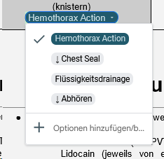

1. [Bubble Wrap has been added to the items list]

2. Minor correction: Hemothorax Action sequence (Lungs Treatment, hemothorax action list)

17.10.2023

The guide has been reworked  significantly in order to cover the most recent changes and additions. Most notable changes:
x Penthrox added to the item list
x EACA, TXA descriptions changed
t Entire new section covering Lungs and Airways which has incorporated related information and includes new additions, i.e. chech breathing extension and inspect chest
t Complete Cardiac Arrest section rework
t Blue included in the thanks list for his immeasurable help
t Appendix rework
x Blood groups table aesthetics rework
t Coagulation section updated
Debridement removed (all related descriptions changed)
New Glossary of terms table for items list
 (Bearbeitet)

1

1
[23:31]
